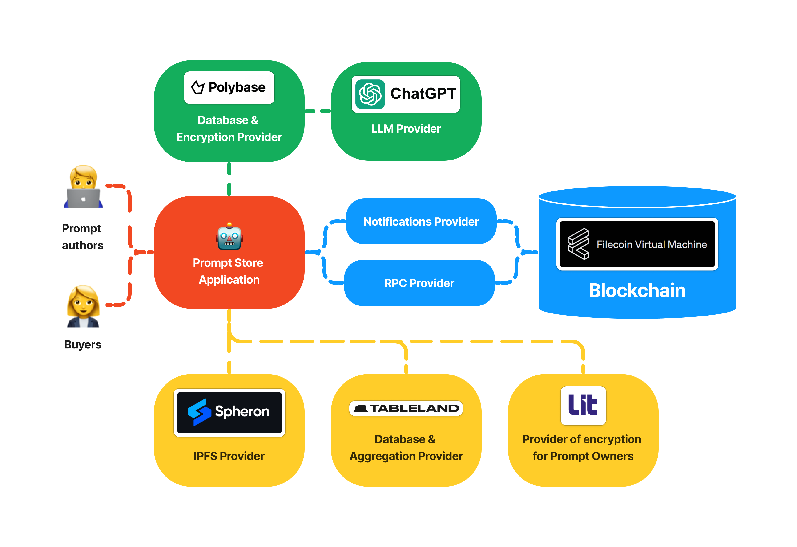

# 🤖 Prompt Store

Web3 marketplace of prompts for GPT, ChatGPT, Bard and other LLM

🔗 [Application](https://prompt-store-app.vercel.app/)

## ✨ Inspiration

Today ChatGPT is disrupting many industries. More and more people are beginning to use it for personal tasks and for business.

They use prompts to do this. But writing and testing effective prompts requires time and skills that not everyone has.

To help such people, we decided to build a marketplace of prompts. A place where developers can sell their work and people or businesses can try and buy it.

## 🔥 What it does

1. First, prompt author needs to create a profile. After that he can upload a prompt and place it for sale.
2. Then everyone can open the marketplace and find the prompt posted by the author.
3. Any user can test the prompt on the prompt page and buy it if they like it.
4. After purchasing the prompt, the author receives a notification.
5. There is also a list of top-selling authors on the marketplace. This way, using the top anyone can find the best developers, contact them, and order a customized solution.

## ⚒️ How we built it

- FVM is used as a blockchain for smart contracts with profiles, prompts, marketplace.
- Polybase is used as a database and encryption provider that allows only ChatGPT to see the prompts source text.
- Spheron is used as an IPFS provider to store metadata of profiles and prompts.
- Tableland is used as a database provider that allows the app to display aggregated lists with the latest prompts and top authors.
- Lit Protocol is used as an encryption provider that allows only the owner of prompt to see the source text.

## 🗻 Challenges we ran into

1. There was a problem with allowing only the ChatGPT service and the owner of the token to read the source text of the prompt. But Polybase and Lit Protocol helped with that.
2. There was also a problem with extracting data from the blockchain to display it in aggregate lists in the app. But Tableland helped with that.

## 💪 Accomplishments that we're proud of

We're proud to have handled the encryption of the prompts and display them in the app as nice lists. Without that, it wouldn't be possible to make a good app.

## 🧠 What we learned

With this project, we learned how to encrypt data in a decentralized way and aggregate data from the blockchain.

## 🚀 What's next for the project

There are a lot of ideas on how to improve this project.

To make the marketplace better, it would be great to add:

- Prompts for graphic services such as DALL·E, Midjourney, Stable Diffusion.
- Copyright verification.
- User-friendly categories and search.
- Tools for quick integration after purchase.
- Features for hiring developers.

## 📃 Contracts

- Profile - 0xbf4340F03E4B73d11aa0C6F63E8E4b0898d98c39
- Prompt - 0x1Bf1d285b5414e94227b1708C51A5CaD18496693
- Marketplace - 0x501C45437a699827992667C3b032ee08FDbaD4f3

## 🏗️ Architecture

